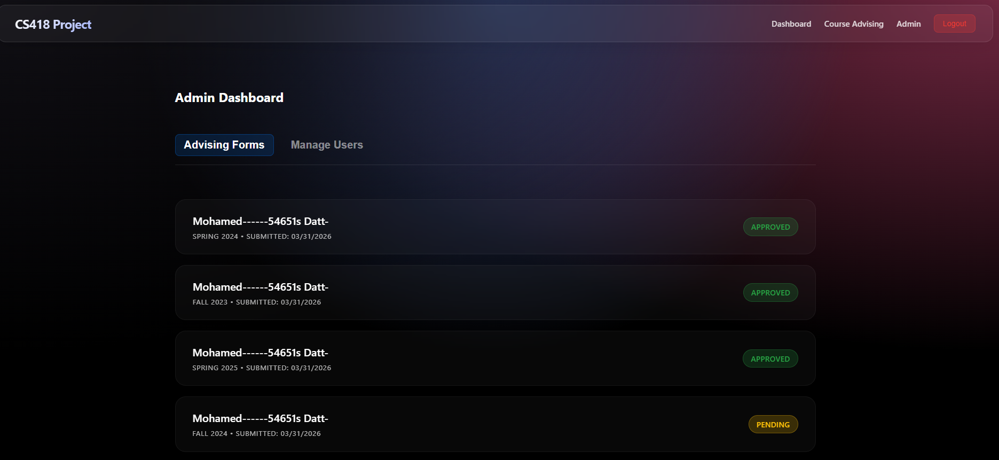
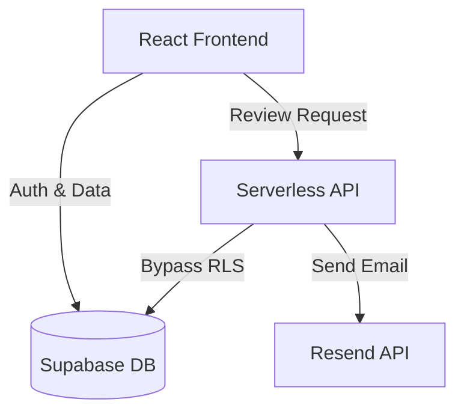

- Project: Course Advising System
- Student name: Mohamed Datt
- Student UIN: [Insert UIN]

## 1. Overview
The website is a fully functional Course Advising System designed for Computer Science department students to securely submit their course plans, and for department administrators to review, approve, or reject these submissions. 

For the frontend, the application is built using **React** (via Vite) and **JavaScript**. For the backend and database, the application utilizes **Supabase** (PostgreSQL) for row-level security, authentication, and data management. Instead of building on top of a traditional Express server, the backend logic for notifications and secure database updates was built using **Vercel Serverless Functions** (Node.js). This ensures seamless cloud deployment without maintaining a standalone server. We also utilized the **Resend API** to handle professional HTML email dispatching.

**Feature Implementation Table:**
| Feature | Implemented? |
| :--- | :--- |
| reCAPTCHA Verification | Yes |
| Clickjacking Prevention | Yes |
| Favicon Integration | Yes |
| Password Regex Validation | Yes |
| Backend Test Cases | Yes |
| Admin Dashboard (Forms Display) | Yes |
| Admin Review Workflow | Yes |
| Status Update Logic | Yes |
| Student Email Notification | Yes |
| Student Portal Status View | Yes |

## 2. Milestone Accomplishments

Table 1: Status of milestone specifications.

| Fulfilled | Feature# | Specification |
| :--- | :--- | :--- |
| Yes | 1 | Add reCAPTCHA to the login page. Verify the reCAPTCHA before login. |
| Yes | 2 | Prevent your application from clickjacking attack. |
| Yes | 3 | Add a favicon to the website. |
| Yes | 4 | Add a password rule requiring a mix of capital letters, lowercase letters, special characters, and numbers (min length 8). |
| Yes | 5 | Create test cases and execute in your BE application (Create at least 3 test cases). |
| Yes | 6 | Develop a screen to display advising forms submitted by CS department students. |
| Yes | 7 | Clicking on a student's name will redirect to a page displaying the student-submitted record with options to approve/reject and provide feedback. |
| Yes | 8 | Implement status update of student records upon submission of approval or rejection. |
| Yes | 9 | Upon submission, student will receive an email where they can see the status and message provided by admin. |
| Yes | 10 | Now student will be able to see the updated status of their advising sheet on Course Advising History form. |

## 3. Architecture

The overall architecture follows a modern, decoupled serverless stack. 
- **Frontend Layer:** Built with React and JavaScript. Handles all user interfaces, client-side routing (React Router), and state management. 
- **Database & Auth Layer:** Supabase (PostgreSQL) manages user sessions, RLS (Row Level Security), and data storage (`profiles`, `advising_records`).
- **Serverless API Layer:** Vercel Serverless functions execute privileged operations (updating statuses by bypassing RLS via Service Role Key) and coordinate third-party APIs.
- **Third-Party APIs:** Resend is used for email delivery, and Google reCAPTCHA v2 is used for security.

## 4. Implementation

**1. Add reCAPTCHA to the login page:**
A Google reCAPTCHA v2 widget is rendered on the login screen. The form submission is blocked and the login button remains disabled until the user successfully completes the captcha challenge. The token state is tracked using React's `useState`.
*You can find the code in `client/src/pages/Login.jsx`.*

**2. Prevent your application from clickjacking attack:**
To prevent the application from being loaded inside a malicious `<iframe>`, client-side frame-busting JavaScript was embedded directly into the application's root HTML file. An anti-clickjacking CSS style hides the body, and the script removes this style only if it detects `self === top`. A demo file was also created to prove its efficacy.
*You can find the code in `client/index.html` and `clickjacking_demo.html`.*

**3. Add a favicon to the website:**
A custom `.ico` file is linked in the head of the application's main HTML file to display the system's icon in browser tabs.
*You can find the code in `client/index.html`.*

**4. Add a password rule requiring a mix of capital letters...:**
During registration and password reset, a rigorous Regular Expression (`/^(?=.*[a-z])(?=.*[A-Z])(?=.*\d)(?=.*[@$!%*?&])[A-Za-z\d@$!%*?&]{8,}$/`) validates the password input. If the criteria are not met, the user is prevented from submitting the form, and a red validation error is displayed.
*You can find the code in `client/src/pages/Register.jsx` and `client/src/pages/ResetPassword.jsx`.*

**5. Create test cases and execute in your BE application:**
Three backend test cases were created using Jest and Supertest. They simulate requests to the notification API to verify successful processing, handle missing fields, and catch internal server errors properly.
*You can find the code in `server/tests/api.test.js`.*

**6. Develop a screen to display advising forms:**
A beautifully styled, tabbed dashboard was developed for administrators. It queries the `advising_records` and `profiles` tables from Supabase and joins the data to display an animated list of student submissions, showing the Student Name, Term, and Status.
*You can find the code in `client/src/pages/AdminDashboard.jsx`.*

**7. Clicking on a student's name will redirect to a page...:**
When an admin clicks a student card on the dashboard, React Router redirects them to a dynamic review page based on the record's ID. This page renders the requested courses and provides "Approve" and "Reject" buttons. A `textarea` enforces that the admin provides feedback before the form can be submitted. Upon submission, it redirects the admin back to the dashboard.
*You can find the code in `client/src/pages/AdminReviewForm.jsx`.*

**8. Implement status update of student records:**
Because the database uses Row-Level Security, the frontend cannot directly alter a student's record. Instead, the review form POSTs the decision to a serverless function, which securely updates the record's status and feedback message in Supabase using a protected Service Role Key.
*You can find the code in `client/api/notify.js`.*

**9. Upon submission, student will receive an email...:**
Inside the same serverless function that updates the database, the Resend API is triggered. It dynamically compiles a rich HTML email template containing the student's name, the term, the approval/rejection status, and the admin's specific feedback message.
*You can find the code in `client/api/notify.js`.*

**10. Student will be able to see the updated status:**
When the student logs in and navigates to their Course Advising History, they see their past submissions. Clicking into a submission dynamically renders an alert box at the top of their advising sheet that displays their updated status and the explicit feedback message left by the administrator.
*You can find the code in `client/src/pages/AdvisingForm.jsx`.*
