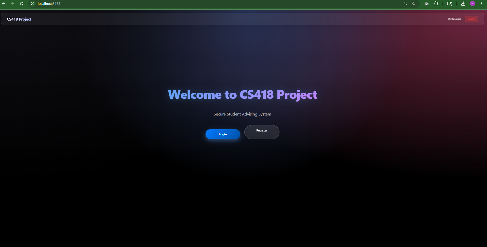
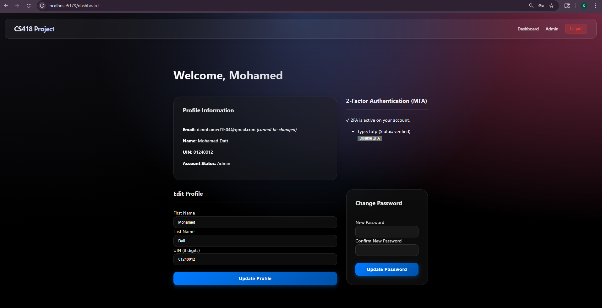
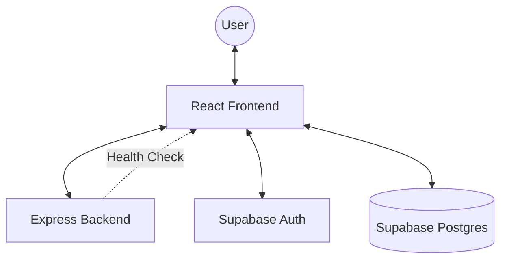

# Project Milestone 1 Report

**Project:** User Authentication System  
**Student name:** Mohamed Datt  
**Student UIN:** 01240012  

All sections are mandatory. Please do not change the format of this template.

## 1. Overview (10 points)

This project is a comprehensive User Authentication System built on a modern full-stack architecture. The primary goal is to provide a secure and scalable platform for user registration, multi-role login (Student/Admin), and profile management.

### Tech Stack
- **Frontend:** React with Vite for a fast and reactive user interface.
- **Backend:** Node.js with Express for server-side logic and health monitoring.
- **Authentication & Database:** Supabase (PostgreSQL) for secure identity management and data storage.

### Feature Implementation Status

| Feature | Implemented | Notes |
|---------|-------------|-------|
| User Registration | Yes | Email/password signup with profile initialization. |
| User Login | Yes | Secure authentication via Supabase. |
| Password Reset | Yes | Email-based password recovery flow. |
| Profile Management | Yes | Edit names and UIN from the user dashboard. |
| Admin Dashboard | Yes | Restricted access to view all registered users. |
| Change Password | Yes | Update password directly from the dashboard. |
| 2-Factor Auth (MFA)| Yes | TOTP implementation (Authenticator Apps). |
| SMTP Email Sys | Yes | Configured Gmail SMTP for reliable delivery. |

### Working Page Screenshots

| Landing Page | User Dashboard |
|--------------|----------------|
|  |  |

---

## 2. Milestone Accomplishments (10 points)

List ALL specifications of this milestone and specify whether certain specifications are fulfilled or not.

**Table 1: Status of milestone specifications.**

| Fulfilled | Feature# | Specification |
|-----------|----------|---------------|
| Yes | 1 | Complete user registration with email and password |
| Yes | 2 | Secure login system with session management |
| Yes | 3 | Password reset functionality via email |
| Yes | 4 | User profile management (First Name, Last Name, UIN) |
| Yes | 5 | Change password feature within the dashboard |
| Yes | 6 | Admin dashboard with user listing capability |
| Yes | 7 | Protected routes for authenticated users and admins |
| Yes | 8 | Integration with Supabase for backend services |
| Yes | 9 | 2-Factor Authentication (TOTP) enforcement |
| Yes | 10 | SMTP Email Verification (Gmail integration) |

---

## 3. Architecture (20 points)

The project follows a standard client-server-database architecture. 

- **Frontend (Client):** Developed using **React**. It handles the UI/UX, routing via `react-router-dom`, and state management for authentication.
- **Backend (Server):** A minimal **Express** server provides a health check API and acts as a gateway for any future custom server-side logic.
- **Backend-as-a-Service (Supabase):** Handles all authentication requests, database operations (Postgres), and session persistence.

### Architecture Diagram

---

## 4. Database Design (20 points)

The database design centers around the `profiles` table, which extends the metadata associated with the Supabase Auth users.

### Table: profiles
Describes your database design including a table showing fields, data types, key types, and a few examples of rows.

| Field | Type | Key | Example |
|-------|------|-----|---------|
| id | UUID | Primary | `550e8400-e29b-41d4-a716-446655440000` |
| first_name | TEXT | - | John |
| last_name | TEXT | - | Smith |
| uin | TEXT | - | `12345678` |
| is_admin | BOOLEAN| - | `false` |
| is_2fa_enabled | BOOLEAN| - | `true` |
| created_at | TIMESTAMPTZ | - | `2026-03-01 12:00:00` |

---

## 5. Implementation (40 points)

Describe how each specification is implemented. Specify and highlight the program file in which each specification is implemented.

### User Registration
Implemented using the Supabase `auth.signUp` method. When a user registers, their basic information (First Name, Last Name, UIN) is stored in the `options.data` metadata, which triggers a project-level function to populate the `profiles` table.
- **File:** [Register.jsx](file:///home/meeksonjr/odu/cs418/M1/Project/client/src/pages/Register.jsx)

### Login and Session Management
The authentication state is managed globally using a React Context. This provider listens to Supabase auth state changes and updates the `user` and `profile` objects throughout the application.
- **File:** [AuthContext.jsx](file:///home/meeksonjr/odu/cs418/M1/Project/client/src/context/AuthContext.jsx)

### Protected Routes
A high-order component `ProtectedRoute` wraps sensitive pages (Dashboard, AdminDashboard). It checks the current session and redirects unauthorized users to the login page.
- **File:** [ProtectedRoute.jsx](file:///home/meeksonjr/odu/cs418/M1/Project/client/src/components/ProtectedRoute.jsx)

### Profile Management
The dashboard allows users to update their personal information. The server performs an `update` operation on the `profiles` table in Supabase.
- **File:** [Dashboard.jsx](file:///home/meeksonjr/odu/cs418/M1/Project/client/src/pages/Dashboard.jsx)

### Admin Functionality
Admin users can access a specialized dashboard. This is controlled by a boolean flag `is_admin` in the user's profile.
- **File:** [AdminDashboard.jsx](file:///home/meeksonjr/odu/cs418/M1/Project/client/src/pages/AdminDashboard.jsx)

### 2-Factor Authentication (MFA)
Implemented TOTP (Time-based One-Time Password) using Supabase's `auth.mfa` API. The system handles enrollment (QR code), verification, and enforcement during the login flow (AAL2 verification).
- **Files:** [Dashboard.jsx](file:///home/meeksonjr/odu/cs418/M1/Project/client/src/pages/Dashboard.jsx), [Login.jsx](file:///home/meeksonjr/odu/cs418/M1/Project/client/src/pages/Login.jsx), [ProtectedRoute.jsx](file:///home/meeksonjr/odu/cs418/M1/Project/client/src/components/ProtectedRoute.jsx)

### SMTP Configuration
Replaced the default Supabase provider with a custom Gmail SMTP configuration to ensure reliable delivery of verification and rest emails.
- **Location:** Supabase Project Settings > Authentication > SMTP
