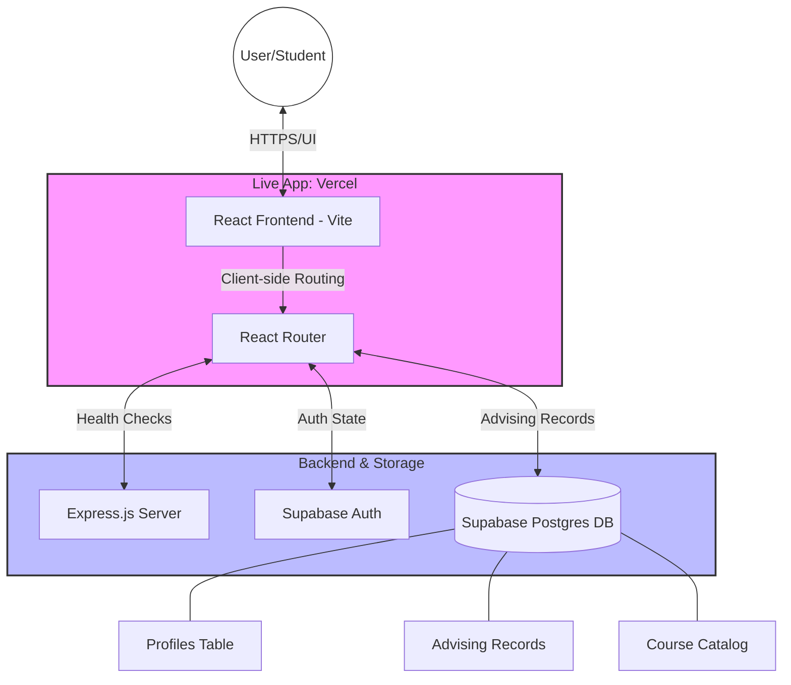

# Project Milestone 2 Report

**Project:** User Authentication & Course Advising System  
**Student name:** Mohamed Datt  
**Student UIN:** 01240012  

## 1. Overview (10 points)

This milestone expands the project by implementing a dedicated **Course Advising System**. Students can now manage their academic progression by submitting and tracking advising records, while the system enforces critical academic rules and provides a streamlined interface for historical data.

### Tech Stack
- **Frontend:** React (Vite) with enhanced CSS for glassmorphism and modern UI.
- **Backend:** Node.js (Express) with Supabase integration.
- **Database:** Supabase (PostgreSQL) with relational tables for records and courses.
- **Deployment:** Live on Vercel at [https://cs418518-s26.vercel.app/](https://cs418518-s26.vercel.app/)

### Feature Implementation Status

| Feature | Implemented | Notes |
|---------|-------------|-------|
| Course Advising History | Yes | Displays previous records with Date, Term, and Status. |
| Advising Entry Form | Yes | Two-section form (History & Course Plan). |
| Dynamic Course Rows | Yes | Level and Course selection via dynamic dropdowns. |
| Course Selection Rules | Yes | Prevents re-selection of courses taken in the last term. |
| Pre-population & Locking| Yes | Auto-fills data; freezes records if Approved/Rejected. |
| Modern Card History | Yes | Upgraded table to a premium card-based list view. |
| Live Deployment | Yes | Successfully deployed on Vercel. |

---

## 2. Milestone Accomplishments (10 points)

**Table 1: Status of milestone specifications.**

| Fulfilled | Feature# | Specification |
|-----------|----------|---------------|
| Yes | 1 | Access to course advising menu after login |
| Yes | 2 | Display Course Advising History (Date, Term, Status) |
| Yes | 3 | Course Advising form with History and Course Plan sections |
| Yes | 4 | Header section with Last Term, Last GPA, and Current Term |
| Yes | 5 | Dynamic rows for Level and Course Name dropdowns |
| Yes | 6 | Rule: Prevent duplicate courses from previous term |
| Yes | 7 | Mark new entries as "Pending" upon submission |
| Yes | 8 | Pre-populate and freeze Approved/Rejected records |
| Yes | 9 | Live Deployment on Vercel |

---

## 3. Architecture & Implementation (40 points)

    
### Course Advising Dashboard (Split-View)
The system now uses a **Unified Master-Detail Dashboard**. This handles large numbers of records by moving the history list into an animated sidebar upon record selection.
- **Master List:** Displays records with status badges and creation dates.
- **Detail Form:** Slides in from the right with a smooth 0.6s cubic-bezier animation.
- **State Management:** The dashboard orchestrates real-time syncing between the list and the form.
- **Files:** `client/src/pages/AdvisingHistory.jsx`, `client/src/pages/AdvisingForm.jsx`

### Dynamic Form & Rules
The advising form utilizes a dynamic state array for course plan rows. The "Course Selection Rule" is enforced by fetching the user's last approved record and comparing course names before submission.
- **File:** `client/src/pages/AdvisingForm.jsx`

### UI/UX Refinements
The styling was enhanced for clarity and visual appeal, with specific fixes for dropdown menu readability in the dark theme.
- **File:** `client/src/App.css`

### Deployment
The application is deployed on Vercel, with environmental variables configured for secure connection to the Supabase backend.
- **URL:** [https://cs418518-s26.vercel.app/](https://cs418518-s26.vercel.app/)
